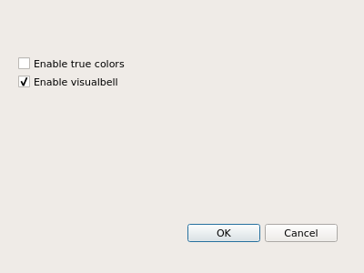

_WARNING_
*PET PROJECT: BACKUP YOUR NVIM configuration beforehand !*

# vim-config
GUI to help configure neovim settings.
Run with `$ ./configurator.py`.

It is UI independant, i.e., it will generate a `init.generated.vim` and source
it from your `init.vim` in case it is not already the case.
Hence you can use this program along with the terminal UI, neovim-Qt, VimR or any other UI out there.

# Dependancies
`python3 -mpip install --user -U neovim pyqt5 `
`python -mpip install --user -U paragrep`
 
# ROADMAP

- Get tooltip from parsing help
- Get oneliner from parsing runtime/optwin.vim (or modify screen.lua
		accordingly)

# Contribute

UI is made by hand with the `designer`utility from Qt suite.
Once you have edited untitled.ui, run `make` to regenerate configuratorUI.py .

Hopefully the UI could be generated from https://github.com/neovim/neovim/blob/master/src/nvim/options.lua !
